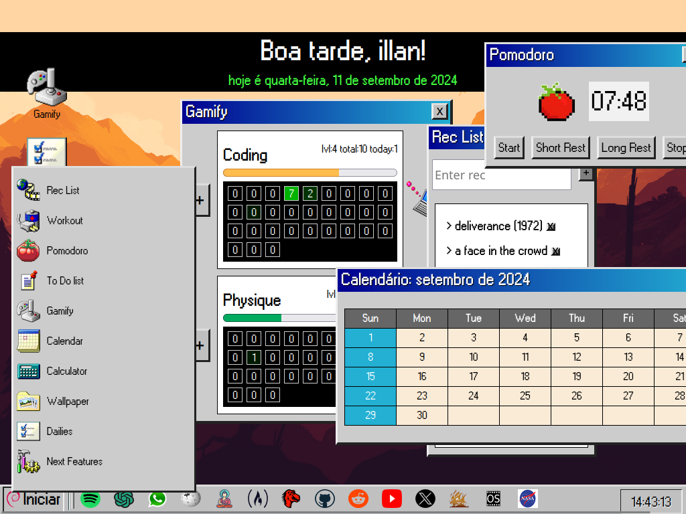
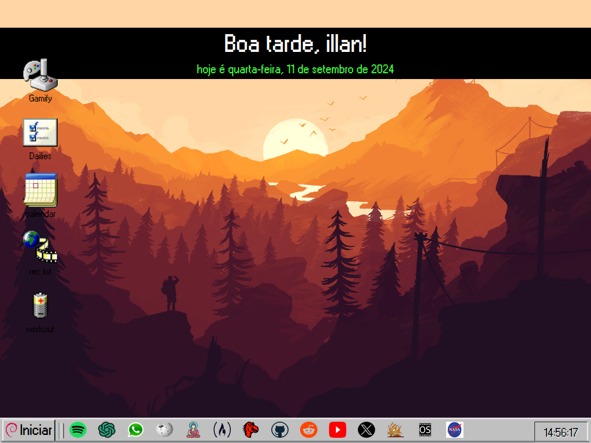

# Startpage - Hub Pessoal com Estilo Retro OS 🎮
## Visão Geral

"Startpage" é uma aplicação web pessoal feita para melhorar minha (de illan) produtividade diária, com uma estética inspirada em sistemas operacionais retrô. O projeto foi desenvolvido exclusivamente para meu uso pessoal, o que significa que não há foco em personalização para outros usuários. Pelo mesmo motivo existem coisas escritas tanto em inglês quanto em português, tanto no GUI quanto no código. Paciência. 

O principal objetivo foi praticar e consolidar o que aprendi no início da minha jornada de desenvolvimento (há quase dois anos), com pequenos ajustes e implementações recentes.

**A aplicação é 100% frontend e foi construída utilizando JavaScript puro, HTML e CSS, sem necessidade de build ou frameworks.** O armazenamento dos dados é feito via localStorage, permitindo que as configurações e o progresso fiquem salvos no navegador.

## Funcionalidades Principais 🚀

- Pomodoro Timer 🍅: Ajuda a organizar sessões de trabalho focado e pausas.
- To-do List 📝: Gerencie suas tarefas diárias de forma simples e prática.
- Rec List 🎥: Lista de recomendações de filmes, livros ou qualquer coisa que eu queira lembrar de ver.
- Dailies ✅: Controle de atividades diárias, parecido com o to-do, mas com foco em hábitos.
- Gamificação 🎮: Duas "skills" (habilidades) para melhorar: Coding e Physique, onde eu acompanho meu progresso diário.
- Calendário 📅: Para visualização rápida do mês atual.
- Workout Plan 💪: Tabela para organizar e acompanhar meus treinos físicos.
- Barra de Links 🔗: Acesso rápido a links úteis que uso no dia a dia.
- Saudação Personalizada 👋: Uma mensagem que muda com base na hora do dia e no nome do usuário (configurado via localStorage).
- Papel de Parede Dinâmico 🖼️: O fundo da aplicação muda de acordo com o mês e o usuário pode escolher entre outras opções disponíveis.

## Tecnologias Utilizadas 💻

 - JavaScript (DOM manipulation)
 - HTML
 - CSS (estilização customizada com temas retrô)
 - localStorage (armazenamento de dados no navegador)

## Versão Completa

Estou trabalhando na versão 2.0, onde planejo incluir um banco de dados e uma estrutura mais robusta, utilizando React, Node.js, e provavelmente PostgreSQL no backend. Ainda estou decidindo entre frameworks como Vite, Astro, ou Next.js para a base do frontend.
Motivação ✨

Este projeto começou como um exercício de consolidação do que aprendi nos meus primeiros anos de estudo de desenvolvimento web. Ele reflete meu progresso em conceitos fundamentais como manipulação do DOM, controle de estados no frontend, e boas práticas com CSS e HTML. Foi uma oportunidade para praticar e criar uma ferramenta que uso no meu dia a dia para ser mais produtivo.

____________________________________________________________________________________

# Startpage - Retro OS Inspired Web Hub
## Overview

Startpage is a personal web application that serves as a daily productivity hub, designed with a retro operating system aesthetic. The project is built entirely using vanilla JavaScript, HTML, and CSS, with data stored via localStorage to allow customization and tracking of user activities without any backend. All windows are draggable and can be hidden or shown based on user interaction.

This project is a demonstration of my front-end skills using core web technologies, specifically DOM manipulation and localStorage. It showcases a practical yet creative application that enhances daily productivity.

## Features

-  Pomodoro Timer: A functional timer for productivity, helping to manage work and break periods.
-  To-Do List: Track your daily tasks with an easy-to-use interface.
-  Workout Table: A simple table to log your daily workout routine.
-  Rec List: Keep a list of recommendations for movies, books, etc.
-  Dailies: A unique feature for tracking recurring daily tasks, distinct from the To-Do list.
-  Gamification System: Track progress in two skills—Coding and Physique—using a visual representation of achievements and goals.
-  Calendar: A retro-style calendar to visualize the month and important dates.
-  Personalized Greeting: Displays a greeting according to the current time, date, and the user's name.
-  Customizable Wallpapers: The background wallpaper changes based on the month, with options for the user to select from predefined wallpapers.
-  Link Bar: A collection of useful links for easy access.

## Technology Stack

-  JavaScript: Core functionality, including DOM manipulation and interactivity.
-  HTML & CSS: Structure and styling, with a strong focus on retro-themed design.
-  localStorage: Used for storing and retrieving data (e.g., user preferences, tasks, and progress).

## Future Plans (Version 2.0)

In the next version of Startpage, I plan to upgrade the project with:

-  A backend using Node.js and PostgreSQL for data storage.
-  Front-end rebuilt with React or a modern framework (still deciding between Vite, Astro, or Next.js).
-  More advanced features and user customizations.

## Installation and Usage

Since this is a no-build web application, there is no need for any installation steps. You can clone the repository and open the index.html file in your web browser.

bash

git clone https://github.com/yourusername/startpage.git

Open index.html directly in your browser.
Demonstration of Skills

## This project demonstrates my ability to work with:

-  Vanilla JavaScript: DOM manipulation and event handling.
-  CSS: Creating a visually appealing and functional interface.
-  localStorage: Managing user data and preferences on the client side.

The simplicity of the tech stack is intended to showcase the power of fundamental web technologies. It's a perfect example of how creative ideas can be implemented without relying on frameworks or build tools.
## License

This project is open source and available under the MIT License.
